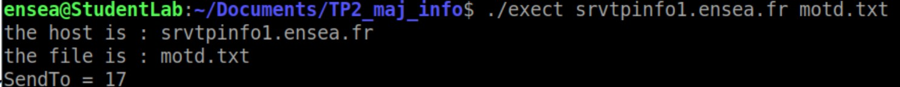

# TP2 by DASQUE Myriam and CARONELLO Marie

  
You are on the Myriam and Marie's Github. This is our Lab2, and the objective is to develop a TFTP client using RFC specifications and Wireshark captures.

## Tasks to Accomplish

In this part we are going to create two clients : one for downloading a file from the server; one for uploading a file to the server.

### To obtain request information

We create a programm to display the file and the host, two parameters in arguments. We get the following result

 
  
  

### To obtain the server’s address.

We make a code that goes trought the linked list 'result'. We can check the server's address by display this address. We get :

 
  
  

### Connection socket to the server.

We complete our own code to reserve a connection socket to server. To check our code we check that socket is diffrent from -1.

 
  
  

### For gettftp

##### RRQ

We want to build a properly formed Read Request and send it to the server. For this program we create an array by allocating memory. For the RRQ we want 2 bytes for operation code , the file, one zero and the 'mode' and finally one zero. 

 
  
  

##### DAT

We want to receive a data packet with a maximum of 512 data bits. To do this, we send a reception request with recvfrom.

 
  
  

